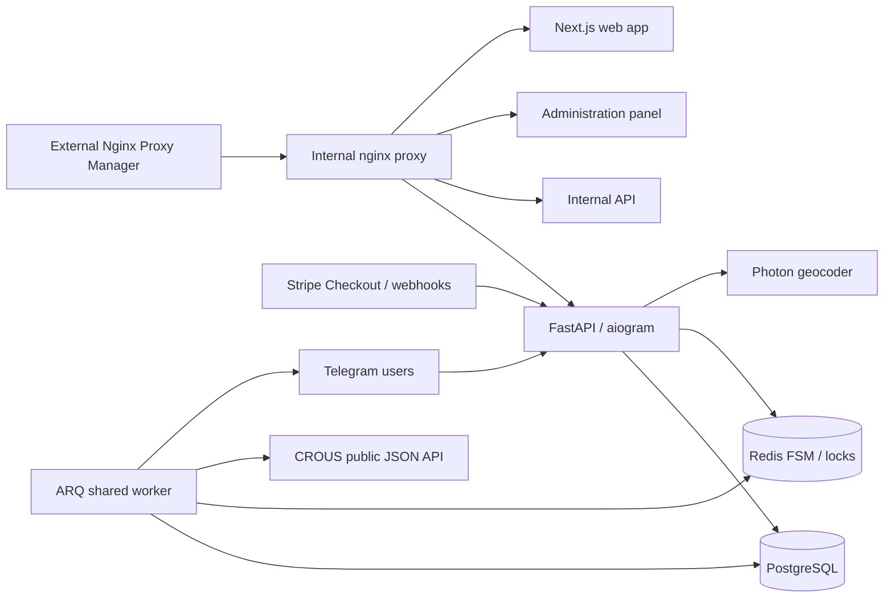

# CROUS data-access investigation — 25 July 2026

## Finding

The public CROUS application is SvelteKit. Its server-rendered search page embeds the same structured data used by the client, so this project uses the public JSON API rather than scraping result-card HTML.

- `GET /api/global/context` exposes enabled campaigns/tools. At investigation time it reported `42` (2025–26, flow) and `47` (2026–27, residual).
- `POST /api/fr/search/{tool_id}` is the search endpoint; an empty JSON body returned a JSON object containing `results.total`, `results.page`, `results.pageSize`, `results.items`, and aggregations. The client sends `{bounds: "west_north_east_south", page}` and accepts filter fields as a controlled extension. On 25 July, a bounds request to tool `47` returned `200`, `results.total=26`, and 20 first-page items.
- `GET /api/health` is used for readiness.
- CROUS’s own Photon endpoint is available at `/photon/api` for place lookup/reverse geocoding.

The client discovers the current highest enabled management year at startup instead of fixing a campaign ID. It detects non-JSON, auth, and overload responses as failures—not empty inventory. Campaign payload conventions can change, so this is the principal operational fragility; versioned fixtures and the discovery probe make that visible.

## Architecture

## Data design

`users` has Telegram identity, language, Trial-use timestamp, and the one active navigation-message token. `searches` owns the selected place, bounds, local price/surface/accommodation-format filters, current snapshot fingerprint, retry state, and enabled status. `listings` stores CROUS’s stable external ID plus normalized display data and raw payload. `search_listings` is the current search-scoped availability snapshot. `search_display_groups` and `search_display_messages` persist exactly the Telegram cards belonging to the active list, so a changed list can be sent safely before the prior list is retired. Historical `notifications`, `image_cache`, and `geocoding_cache` are retained for compatibility and caching.

Subscription products live in `subscription_plans`; immutable payment attempts live in `purchases`; `user_subscriptions` records the actual entitlement periods. This separates product configuration, financial history, and access history. Stripe Checkout Session ID and event ID are unique database keys, so duplicate webhook deliveries cannot create duplicate purchases or extend access twice.

## Interaction and delivery

`/start` creates/edits the single navigation message. Callback version and Telegram message ID must both match the stored user state; stale buttons are rejected. Back buttons return to the prior logical page for location, filters, subscription detail/payment, language, monitoring, and current-list navigation. Listing cards are separate permanent photo/text messages with one direct CROUS detail link. A failed remote image falls back first to a validated temporary upload, then to a text card.

The ARQ scheduler wakes each minute but only queues searches whose effective entitlement interval is due. Free users default to hourly checks; Trial, Season, and Lifetime default to two-minute checks. Deactivated searches are excluded without deleting location, filters, or availability history.

Stripe Checkout is created server-side. `POST /stripe/webhook` validates Stripe's signed raw payload and accepts paid `checkout.session.completed` events only. Stripe success redirects are deliberately not an activation path.

The internal Nginx container only routes Compose-network traffic and emits access/error logs to Docker. It does not terminate TLS or configure certificates. The external Nginx Proxy Manager forwards to port 8080; internal Nginx forwards webhook/payment/root traffic to `app`, strips `/crous_bot_api`, `/panel`, and `/web_app` before forwarding to their dedicated services, and supports HTTP/1.1 upgrades for the Next.js path.

Only HTTPS images from an explicit host allow-list may be fetched. Each redirect is revalidated, private/local IP destinations are refused, downloads are streamed with an 8 MB ceiling, and JPEG/PNG/WebP signatures are checked.
